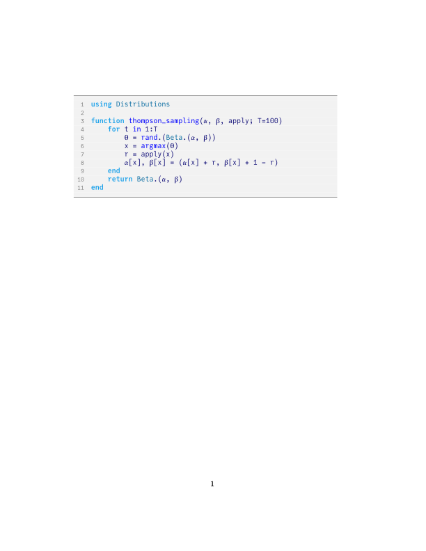

# julia-mono-listings

A custom Julia language style for the LaTeX `listings` package, and Unicode support for the [JuliaMono](https://juliamono.netlify.app/) font in a `lstlisting` environment.
- JuliaMono: https://github.com/cormullion/juliamono
- Julia Unicode: https://docs.julialang.org/en/v1/manual/unicode-input
- Julia pygments: https://github.com/sisl/pygments-julia

> Note, we use `lualatex` for compilation.

## Example

Typesetting the [*Thompson sampling algorithm*](https://github.com/mossr/BeautifulAlgorithms.jl/blob/master/src/thompson_sampling.jl) from [`BeautifulAlgorithms.jl`](https://github.com/mossr/BeautifulAlgorithms.jl).

- See template on [Overleaf](https://www.overleaf.com/read/qrpfvszrjjwf) (go to "Menu" ⟶ "Copy Project", must be logged in).

**The LaTeX document:**
```latex
\documentclass[11pt]{article}

\input{julia_font}
\input{julia_listings}

\lstdefinelanguage{JuliaLocal}[]{Julia}{ % inherit Julia lang. to add keywords
    morekeywords=[3]{thompson_sampling}, % define more functions
    morekeywords=[2]{Beta, Distributions}, % define more types and modules
}

\begin{document}
\begin{lstlisting}[language=JuliaLocal, style=julia]
using Distributions

function thompson_sampling(𝛂, 𝛃, apply; T=100)
    for t in 1:T
        𝛉 = rand.(Beta.(𝛂, 𝛃))
        x = argmax(𝛉)
        r = apply(x)
        𝛂[x], 𝛃[x] = (𝛂[x] + r, 𝛃[x] + 1 - r)
    end
    return Beta.(𝛂, 𝛃)
end
\end{lstlisting}
\end{document}
```

**Output PDF:**

<kbd>
    
</kbd>


# License

The font license is located [here](https://github.com/cormullion/juliamono/blob/master/LICENSE), and the license for this repo is located at [LICENSE.md](./LICENSE.md).
